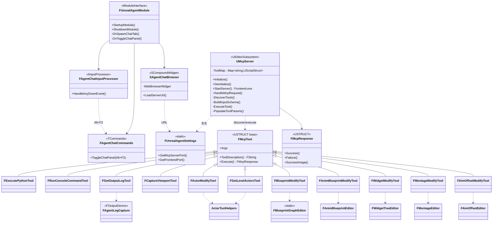

# UnrealAgent

## Skill 작성 가이드

### Skill이란

UnrealAgent의 Skill은 **사용자가 `/<skill-name>`을 입력하면 그 본문이 `<system-reminder>`
형태로 user 메시지에 주입되는 "워크플로 템플릿"**이다. 반복되는 멀티스텝 작업을 한 번의
슬래시 명령으로 묶고, 프로젝트 컨벤션과 검증 절차를 매번 강제할 수 있다.

> **모델이 스스로 호출하지 않는다.** Claude Code의 `Skill` 도구(모델 자동 호출)와 달리
> UnrealAgent의 Skill은 사용자가 명시적으로 `/명령`을 입력해야 발동한다.

#### Skill vs. Context 구분

| 구분 | `contexts/*.md` | Skill (`SKILL.md`) |
|------|-----------------|--------------------|
| 발동 | 사용자 메시지 **키워드 자동 매칭** | 사용자가 **`/명령` 직접 입력** |
| 내용 | UE Python API **지식** (참조 문서) | 작업 **절차·체크리스트** (워크플로) |
| 용도 | "무엇을 아는가" 주입 | "어떻게 할 것인가" 주입 |

→ 지식은 contexts가 이미 자동 주입하므로, Skill 본문에는 **API 설명을 재나열하지 말고
절차·규칙·검증에 집중**한다.

### 파일 위치

스킬은 **프로젝트 단위**로 저장된다:

```
<언리얼프로젝트루트>/.unrealagent/skills/<skill-name>/SKILL.md
```

`skills/` 하위의 각 디렉토리에 `SKILL.md`를 하나 두면, 에이전트 시작 시 자동으로
스캔·등록된다(`SkillRegistry.DiscoverSkills`). **새 스킬을 추가하면 에이전트를
재시작**해야 인식된다(스캔은 시작 시 1회).

### SKILL.md 형식

YAML 프론트매터 + 마크다운 본문:

```markdown
---
name: widget-ui
description: UMG 위젯을 생성·수정한다. 위젯 트리·바인딩·시각 검증까지 한 번에 수행.
---

이 작업은 완료까지 연속으로 수행한다. ...
(절차/체크리스트 본문)
```

유효한 프론트매터 키 (그 외 키는 무시됨):

| 키 | 기본값 | 의미 |
|----|--------|------|
| `name` | (필수) | 슬래시 명령 이름. `/name` 으로 호출. |
| `description` | (필수) | 한 줄 설명. 자동완성 팝업·목록에 표시. |
| `user-invocable` | `true` | `false`면 `/` 자동완성 팝업에서 숨김. |
| `disable-model-invocation` | `false` | (현재 모델 자동호출 미지원이라 실효 없음) |

### 본문 작성 패턴

1. **첫 줄에 "연속 수행" 지시**: 베이스 프롬프트가 "한 번에 한 작업"으로 단발 실행을
   유도하므로, 멀티스텝 스킬은 첫 줄에서
   *"이 작업은 완료까지 연속으로 수행한다. 한 단계만 하고 멈추지 말 것"* 을 명시해
   제약을 무력화한다.
2. **도구 이름을 명시**: 사용할 네이티브 도구를 정확히 적는다 — `widget_modify`,
   `blueprint_modify`, `capture_viewport`, `get_output_log`, `run_console_command`,
   `execute_python`, `actor_modify`, `get_level_actors` 등. 어떤 도구가 무엇에
   쓰이고 무엇이 **불가**한지(예: "위젯 트리는 Python 불가, widget_modify 사용")도 적는다.
3. **프로젝트 컨벤션 baking**: 네이밍 접두사(`WBP_`, `B_`, `SM_` …), 중복 생성 금지,
   기존 GameplayTag/코드 컨벤션 준수 같은 규칙을 본문에 박아 매번 반복 입력을 없앤다.
4. **검증 단계 포함**: 변경 후 `capture_viewport` + `get_output_log`(경고/에러까지)로
   자가검증하고 결과를 보고하게 한다.

### 좋은 예 / 나쁜 예

- 🟢 **좋음**: "1) `widget_modify list_widgets`로 현 트리 확인 → 2) 패널부터 `add_widget`
  → 3) 클릭 로직은 `blueprint_modify ComponentBoundEvent` → 4) `capture_viewport` 검증"
  처럼 **도구·순서·검증이 있는 절차**.
- 🔴 **나쁨**: "UMG의 `unreal.WidgetTree` API는 ... 다음 함수를 제공한다 ..." 같은
  **API 지식 재나열** — 이건 contexts/*.md의 역할이고 토큰만 낭비한다.

### 호출 방법

채팅 입력창에 `/`를 치면 등록된 스킬이 자동완성으로 뜬다. **스킬 이름 뒤에 작업 내용을
한 줄로 붙여** 호출하면, 그 텍스트가 스킬 본문(절차 지침) 뒤에 함께 모델로 전달된다:

```
/widget-ui WBP_HealthBar에 체력 ProgressBar 추가해줘
/task-doc Docs/INVENTORY_SYSTEM_KR.md 기반으로 진행
/fix-build  (이어서 컴파일 에러 붙여넣기)
```

> 인자 없이 `/widget-ui` 만 입력하면 절차 지침만 주입된다. 그 뒤 메시지로 작업을 이어가면 된다.

**후속 메시지에는 `/`를 다시 칠 필요가 없다.** 한 번 주입된 스킬 지침은 대화 기록에
남아 같은 세션 동안 모델이 계속 따른다. 다시 호출하면 본문이 재주입될 뿐이며, 이는
`/compact`로 앞 내용이 압축돼 사라졌거나 다른 스킬로 전환할 때만 유용하다.

### 기본 제공 스킬 (Shooter 프로젝트)

| 스킬 | 용도 |
|------|------|
| `/widget-ui` | UMG 위젯(HUD/크로스헤어) 생성·수정·바인딩·시각 검증 |
| `/task-doc` | Docs 문서 기반 구현 + 착수 전 컨벤션·중복 점검 |
| `/fix-build` | C++ 컴파일 에러 진단·수정·재빌드 검증 |
| `/diagnose-crash` | 런타임 크래시(Access violation·GAS ASC) 근거 기반 분석 |
| `/debug-clean` | 임시 디버그 로그·CVar·주석 제거 정리 |
| `/verify` | 변경 후 뷰포트 캡처 + 전체 로그로 자가검증 |


## 클래스 다이어그램

